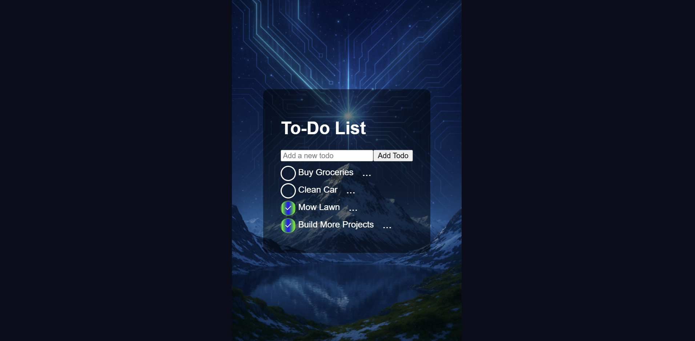

# To-Do List App

  ## Description
  A simple and interactive to-do list built with React. Users can add, check off, edit, delete, and rearrange tasks.

  ## Features
  -Add tasks
  -Edit tasks
  -Delete tasks
  -Drag and drop to reorder
  -Saved in localStorage

  ## 

  ## Installation
  To install necessary dependencies, run the following commands:
    git clone https://github.com/laneman952/To-Do-List.git
    cd To-Do-List
    npm install
    npm start

## Tech Stack
-React 

-JavaScript 

-CSS 

-localStorage 

-Render (for deployment) 

## License

## Questions
If you have any questions, please feel free to contact me.
GitHub: https://github.com/laneman952
LinkedIn: https://www.linkedin.com/in/kyle-lane-713483334/